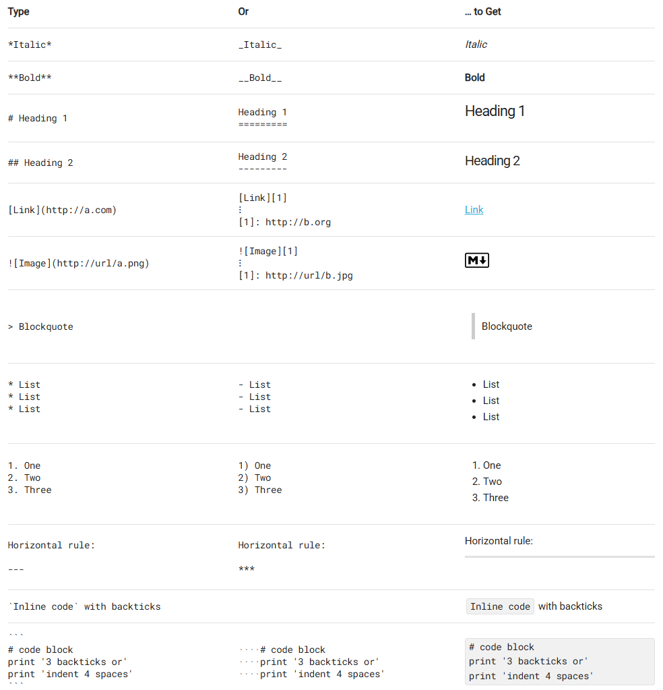
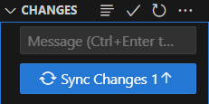
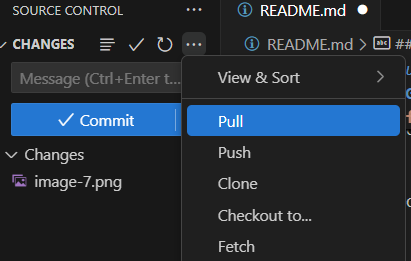
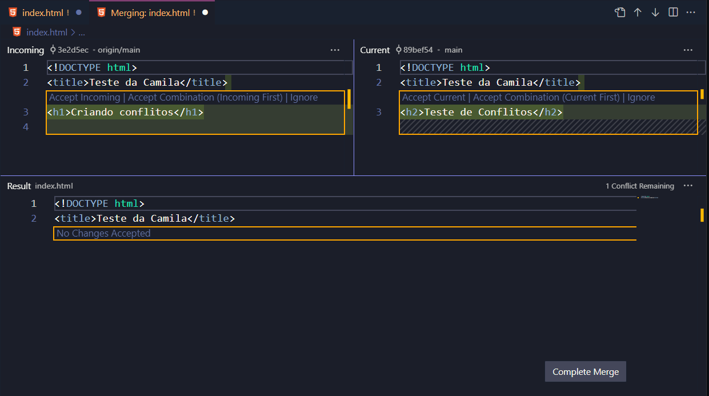

## *Olá, eu sou Gustavo!*
### Super anotações

#### 📃 [Markdown Guide - Basic Syntax!](https://www.markdownguide.org/basic-syntax/)

#### 📘 [Como criar um README para o seu perfil do GitHub](https://www.alura.com.br/artigos/como-criar-um-readme-para-seu-perfil-github)

#### 📘 [Como escrever um README incrível no seu Github](https://www.alura.com.br/artigos/escrever-bom-readme)

####   [Devicon Icons](https://devicon.dev/)
#### ⭐ [   Native Icons](https://gist.github.com/rxaviers/7360908#file-gistfile1-md)

### Git e GitHub

GitHub - Plataforma de hospedagem de códigos e afins, constrúido em base no GIT. Basicamente é como uma rede social dos desenvolvedores, mas mostrando e organizando todos os seus materiais e criações

GIT - Ferramenta para manipular as versões dos códigos, afim de salvar as alterações, verificar quem ou que fez tal alteração, voltar versões antigas. Tal ferramenta ajuda a desenvolvimento colaborativo e não dependente de apenas uma pessoa desenvolver uma coisa do início ao fim. É um Sistema de Controle de Versão Distribuído (VCS), tal qual todo DEV tem uma cópia completa do histórico do projeto em sua máquina local, não apenas online. Isso torna o trabalho offline possível e de forma mais eficiente.

#### [Documentação oficial do GIT](https://git-scm.com/book/pt-br/v2/Come%C3%A7ando-O-B%C3%A1sico-do-Git)
#### [Git flow - Alura](https://www.alura.com.br/artigos/git-flow-o-que-e-como-quando-utilizar)

git init: Converte diretório local em um repositório GIT (Utilizar apenas 1 vez)

git push: Usado para sincronizar as mudanças do repositório local para o repositório online

git remote add: Usado para dizer ao git o local onde as cópias dos repositórios onlines estão localizadas. Estabelecendo a conexão contre o local e o remoto.

git remote -v: Listar todos os locais remotos que já foram configurados

git remote remove origin: Remover um repositório remoto

git remote set-url origin https://github....: Alterar a Url de um repositório remoto

git remote rename origin novo-origin: Renomear o apelido de um repositório remoto

git clone: Funciona para clonar repositório, apenas utilizando o terminal do windows, o código + o link disponibilizado no respositório ao clicar em code

git status: Verifica o status geral, incluindo as mudanças feitas e ainda não sincronizadas

git log: Lista os commits já realizados

git diff: Antes de add, ele mostra as alterações desde o último commit

git add .: Prepara e adiciona as atualizações para serem atualizadas de fato no diretório online, ao dar o git status, após add ele ficar verde

git commit: Serve para de fato salvar as alterações localmente que você fez.

OBS: Commit com vários autores -> [Doc GitHub](https://docs.github.com/pt/pull-requests/committing-changes-to-your-project/creating-and-editing-commits/creating-a-commit-with-multiple-authors)

git commit --amend -m "mensagem": Serve para modificar um commit recente

git push origin main: Após salvar localmente, você compartilha com o repositório online. OBS: para compartilhar com um projeto que você não é o criador, precisa de uma permissão prévia no repositório do GitHub

git pull origin main: Oposto do git push, ele verifica e extrai o repositório online, normalmente útil para puxar o novo repositório atuaizado por outros colaboradores.

git reset: Funciona para desfazer alterações do repositório, normalmente ideal somente alterar o repositório local

#### O Fluxo Comum no Dia a Dia:
Modifique arquivos no seu projeto. ✍️
1) Use **git status** para ver o que foi alterado. 🤔
2) Use **git add .** (ou git add <arquivos>) para preparar as alterações que você quer salvar. 📦
3) Use **git status** novamente para confirmar que as alterações estão na área de staging. ✅
4) Use **git commit -m "Sua mensagem"** para salvar essas alterações no histórico local. 📝
5) Use **git push** para enviar suas alterações salvas para o repositório remoto (GitHub). 🚀

Sinalizações no explorer

M - A letra M representa o estado Modified, do português modificado. Isso significa que o arquivo já existia no repositório, mas que recebeu alguma modificação que ainda não foi registrada no Git.

U -  A letra U representa o estado Untracked, do português não rastreado. Isso significa que o arquivo ainda não existia no repositório e que ainda não teve seu registro (commit) feito no Git.

Boas práticas para mensagem do commit - 
1) Mensagem curta e direta
2) Uso do verbo no infinitivo, ex: "Atualizar texto do título da página"
3) Evitar detalhes tecnicos

Branches - São como se fosse linhas do tempo do código, permite que você instancie uma versão do código master\main, daí você consegue desenvolver e alterá-lo para corrigir ou incrementá-lo, porém sem o risco de alterar o código principal. Em tese você desenvolve, passa por vários testes e somente após a versão de desenvolvedor esteja estável e testada, ele atualiza o código master\main

Master\Main - Código principal, ele só é atualizado após as instâncias de desenvolvimento sejam completamente estáveis. Isso é importante pois em um mundo onde várias pessoas estão desenvolvendo várias atualizações em paralelo, é comum dar conflito e isso precisa ser resolvido antes de atualizá-lo

Repositories - Lugar \ Pasta para salvar e organizar seus arquivos referente aos seus projetos (Códigos, imagens, docs e afins). É a unidade fundamental de organização do GitHub, onde ele rastreia todas as mudanças.

Pull Requests (PRs) - É um mecanismo para propor e revisar alterações, quando você termina de trabalhar em um Branch, você abre um PR para sugerir e disponiblilizar uma prévia das suas alterações. Outros DEVs podem revisar o código, sugerindo melhorias e correções. Após isso, aprovar tais alterações para prosseguir com as atualizações e mesclagens de códigos

Code Review - Integrado com os PRs, permite que os devs verifiquem o que foi alterado.

Issues (Problemas/Tarefas) - Como se fosse algumas anotações ou TAGs para indicar ações que precisam ser tomadas. Como correção de algum bug identificado, melhorias a serem implementadas ou gerenciar tarefas. É uma forma de comunicação eficiente considerando o desenvolvimento compartilhado

Wikis e DOCs - Um repositório que geralmente contém wikis e ferramentas para criar e manter as documentações dos projetos. Isso ajuda aos novos mebros entenderem o código que já foi desenvolvido para começar a atuar

Integração Contínua/Entrega Contínua (CI/CD) com GitHub Actions - Permite automatizar os fluxos de trabalho diretamente no repositório, é possível configurá-lo para que, automaticamente quando um código seja enviado, ele seja testado (Integração Contínua) e construído e implementado em um servidor (Entrega Contínua)

#### Resolvendo Conflitos de Merge com o VS Code

Conflitos de merge acontecem quando duas alterações diferentes modificam a mesma parte de um arquivo e o Git não sabe qual manter. O Visual Studio Code Merge Editor é a ferramenta ideal para resolver isso.

Como funciona:

**Detecção do Conflito**: Ao tentar um git pull, merge ou rebase, se houver um conflito, o Git pausa e o VS Code marca o arquivo.

**Abertura do Editor**: Clique no arquivo conflitante (ícone de alerta) e selecione "Resolver em Merge Editor" ou "Open Merge Editor".

Interface: O editor exibe três painéis:

Esquerdo (Current): Suas alterações.

Direito (Incoming): As alterações que estão sendo incorporadas.

Central (Result): Onde você constrói a versão final, combinando ou escolhendo as partes.

**Resolução**: Use os botões "Accept Current Change", "Accept Incoming Change" ou "Accept Both Changes" para decidir. Você também pode editar manualmente o painel "Result" para combinar o conteúdo.

**Finalização**: Após resolver todos os conflitos visuais no painel "Result" e salvar o arquivo, adicione-o ao stage (git add <nome_do_arquivo>) e, em seguida, faça o commit (git commit) para completar a resolução do merge.

Arquivo .gitignore - É um arquivo criado com este nome e tudo que estiver confugurado nele não será incluido nos commits, mesmo se você der o git add .

~~~
Padrões Comuns do .gitignore
nome_arquivo.txt: Ignora um arquivo específico com esse nome exato.

pasta_exemplo/: Ignora um diretório (pasta) completo com esse nome e todo o seu conteúdo. A barra final / é opcional, mas recomendada para clareza em diretórios.

*.log: Ignora todos os arquivos com a extensão .log em qualquer lugar do repositório. O asterisco * é um curinga.

**/cache/: Ignora qualquer diretório chamado cache em qualquer subdiretório do projeto. ** representa zero ou mais diretórios.

!nao_ignorar_este.txt: Impede que um arquivo específico seja ignorado, mesmo que corresponda a um padrão anterior.

node_modules/: Ignora a pasta node_modules, que contém as dependências de projetos JavaScript/Node.js.

venv/: Ignora a pasta venv, usada para ambientes virtuais Python.

.env: Ignora o arquivo .env, que geralmente guarda variáveis de ambiente e informações sensíveis.

*.tmp: Ignora arquivos com a extensão .tmp, frequentemente usados como arquivos temporários por programas.

.DS_Store: Ignora arquivos ocultos criados pelo macOS.

Thumbs.db: Ignora arquivos ocultos de miniaturas criados pelo Windows.

target/: Ignora a pasta target, onde ficam os arquivos de build de projetos Java (Maven/Gradle).

.vscode/: Ignora a pasta .vscode, que contém configurações específicas do VS Code para o projeto.
~~~~

gist - é um serviço do GitHub para compartilhar pequenos trechos de código, notas ou arquivos de texto de forma simples, tpo um mini repositório que você pode compartilhar o link